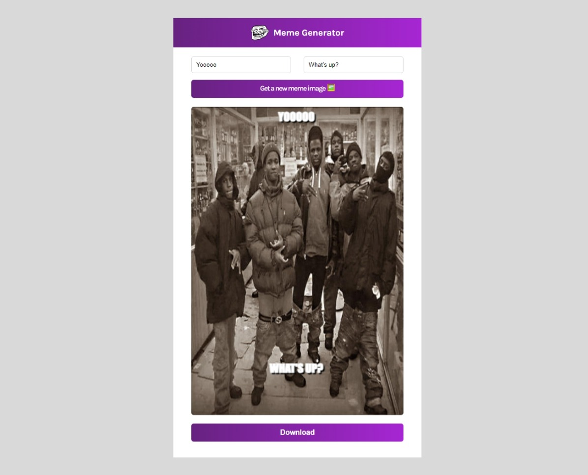

# MEME GENERATOR

This is a repository contains the source code for building the meme generator app using Reactjs

## Table of contents

- [MEME GENERATOR](#meme-generator)
  - [Table of contents](#table-of-contents)
  - [Overview](#overview)
    - [Screenshot](#screenshot)
    - [Links](#links)
  - [My process](#my-process)
    - [Built with](#built-with)
  - [Author](#author)
  - [Acknowledgement](#acknowledgement)

## Overview

### Screenshot

### Links

- Solution URL: [Github repository](https://github.com/Emmanuel-Afrifa/meme-generator)
- Live Site URL: [Deployed site](https://letshahaha.netlify.app/)

## My process
- Responsive web aplication that makes fetches meme images from the imgflip api
- Renders a random meme image 
- Uses the top and bottom input fields to write text on the top and bottom of the image
- Download button that has the functionality to download the image with the text written on it. The image is rendered on on an HTML Canvas to make it downloadable.

### Built with

- HTML
- CSS
- Flexbox
- [React](https://reactjs.org/) - JS library

## Author
- Emmanuel Afrifa
- [emmaquame9@gmail.com](mailto:emmaquame9@gmail.com)
- [Frontend-Mentor](https://www.frontendmentor.io/profile/Emmanuel-Afrifa)
- [Twitter](https://twitter.com/Emma33712365)
- [Linkedin](https://www.linkedin.com/in/emmanuel-afrifa-840674214/)

## Acknowledgement
- [React Course 2022](https://www.youtube.com/watch?v=bMknfKXIFA8&t=122s&pp=ygVHUmVhY3QgQ291cnNlICBCZWdpbm5lcnMgVHV0b3JpYWwgZm9yIFJlYWN0IEphdmFTY3JpcHQgTGlicmFyeSAyMDIyXzM2MHA%3D)
- [Codecademy](https://www.codecademy.com/)
- [FreeCodeCamp Responsive Web Design](https://www.freecodecamp.org/learn/responsive-web-design/)